#Introduction To Animation and Robotics – Assignment 1: Optimization and Visualization
**Name:** Amjad Abd El Rahim 
**ID:** 207570227

---

## Task 1.1: Understand the code structure

I reviewed the original Vedo GUI code and confirmed its modular layout:
- **Imports**
- **Callbacks** (mouse, keyboard, sliders)
- **Optimization functions** (gradient, Hessian, step definitions)
- **Plotting & GUI setup**

**Enhancement:** Added a right‑click callback that drops a red sphere and labels "Boom!" at the clicked 3D location.

```python
def OnRightClick(evt):
    if evt.object is None or evt.picked3d is None:
        return
    pt = evt.picked3d
    sphere = vd.Sphere(pos=(pt[0], pt[1], pt[2]), r=0.03, c='red')
    label  = vd.Text2D("Boom!", pos=(0.02, 0.9), font="VictorMono")
    sphere.name, label.name = 'BoomSphere','BoomLabel'
    plt.remove('BoomSphere','BoomLabel')
    plt.add(sphere, label)
    plt.render()
plt.add_callback('mouse right click', OnRightClick)
```

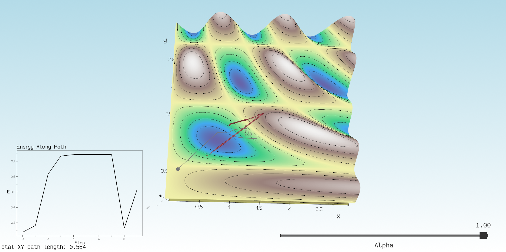
---

## Task 1.2: Plot function value along the path

**Enhancement:** On every mouse move, append the point to `Xi` and update a 2D energy graph in real time. Used `vedo.plot` + `clone2d()`.

```python
def OnMouseMove(evt):
    global Xi
    # ... append to Xi ...
    if Xi.shape[0] > 1:
        plt.remove('PathGraph')
        y = Xi[:,2]
        x = np.arange(len(y))
        g = plot(x, y, title='Energy Along Path', xtitle='Step', ytitle='E')
        g2 = g.clone2d(); g2.name = 'PathGraph'
        plt.add(g2)
    plt.render()
```


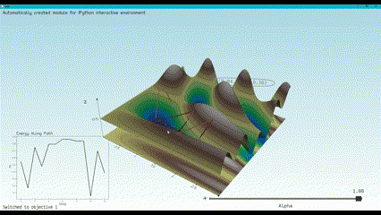
---

## Task 1.3: Change function via GUI

**Enhancement:** Mapped keys **1**, **2**, **3** to three objective functions. Pressing a key resets the path and re‑plots the surface & isolines.

```python
def OnKeyPress(evt):
    global Xi, current_objective
    key = evt.keypress
    if key in ['1','2','3']:
        idx = int(key) - 1
        current_objective = objectives[idx]
        Xi = np.empty((0,3))
        # replot surface + 2D floor clone
        # ...
        plt.render()
plt.add_callback('key press', OnKeyPress)
```
**function2:**
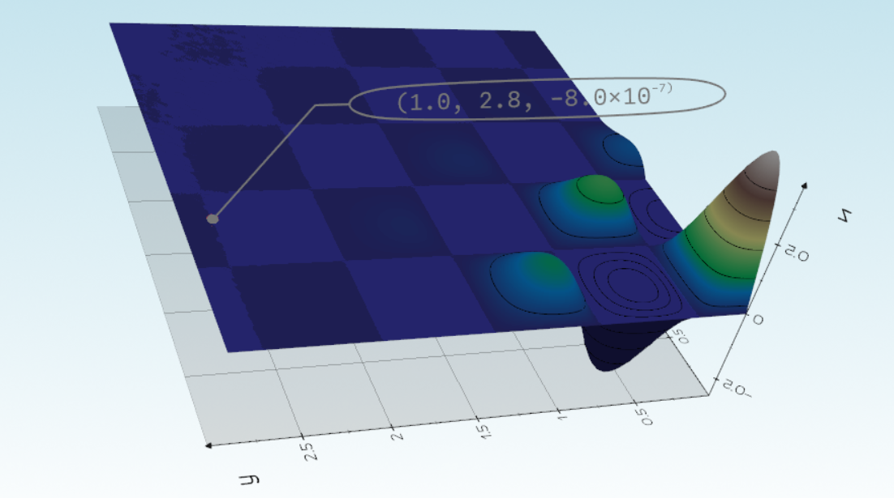
**function3:**
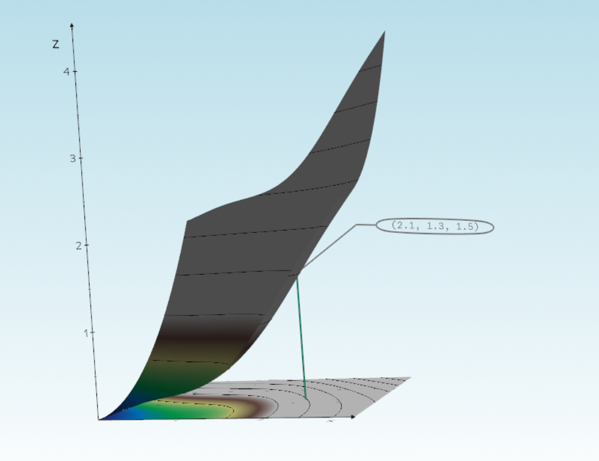
---
## Task 2.1: Disable automatic path drawing

**Change:** Commented out the line in `OnMouseMove` that appends to `Xi` to prevent auto‑tracing.
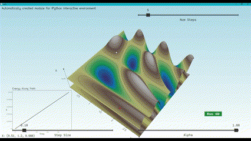

---

## Task 2.2: Left‑Click Initial Guess

**Enhancement:** Added `OnMouseLeftClick` callback to clear `Xi`, set the clicked point as the initial guess, and display a marker.

```python
def OnLeftClick(evt):
    global Xi
    pt = evt.picked3d
    Xi = np.array([[pt[0], pt[1], current_objective([pt[0],pt[1]])]])
    mk = vd.Sphere(pos=(pt[0], pt[1], 0), r=0.03, c='red')
    mk.name = 'InitMarker'
    plt.remove('InitMarker')
    plt.add(mk);
    plt.render()
plt.add_callback('mouse left click', OnLeftClick)
```
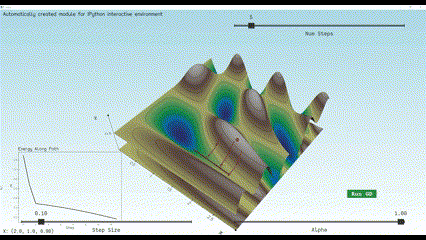

---

## Task 2.3: Gradient Descent Behavior

**Enhancements:**
- Added **Run GD** button to perform `n_steps` of gradient descent on click.  
- Visualized arrows for each step.  
- Energy plot updates via `PathGraph`.

```python
plt.add_button(OnGDStep, states=['Run GD'], pos=(0.85, 0.2))

# OnGDStep implementation:
#   for _ in range(n_steps):
#       ... compute g = gradient_fd(...)
#       Xi = append new point
#       plt.add(vd.Arrow(...))
#   update PathGraph
```
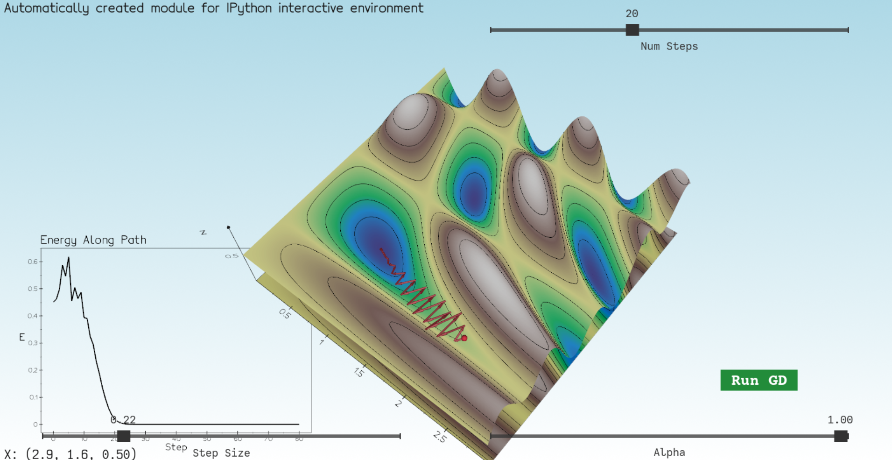
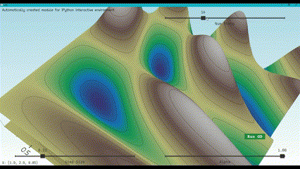

---

## Task 3.1 + 3.2 Gradient Descent vs. Newton’s Method

In this task, I implemented both methods to optimize a 2D function and compare their behavior:

1. **Select initial point** by clicking on the surface.  
2. **Run multiple steps** using one button: **Run ALL** that runs both GD and Newton each one with a different colour.  
3. **Visual comparison** of paths in 3D and overlaid in the 2D energy plot.

- **Gradient Descent (purple):** stepped via `x ← x – α∇f`.  
- **Newton’s Method (red):** stepped via `x ← x – H⁻¹∇f`.

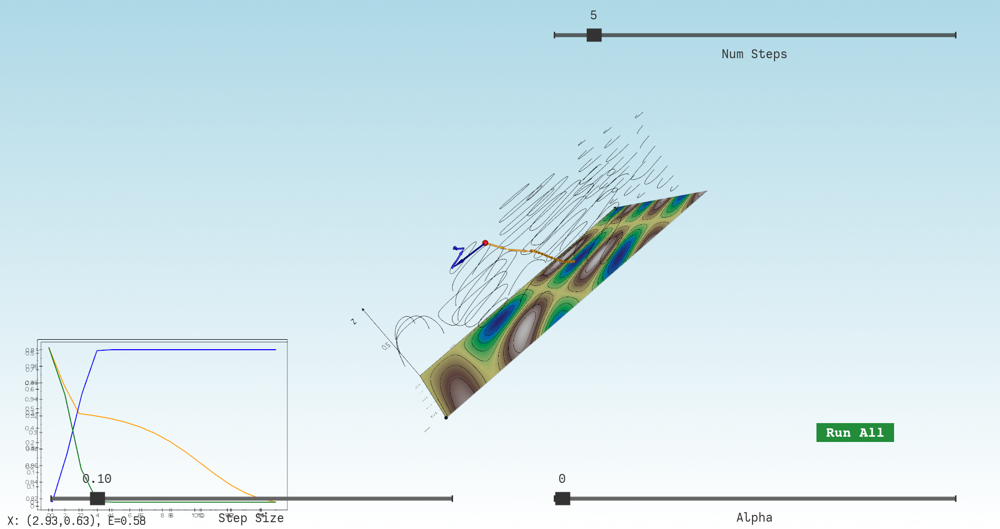 
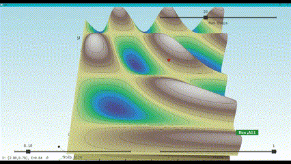

## Task 3.3 Dot Product Verification

To confirm Newton’s direction is a descent, compute at each Newton step:
```python
dot = np.dot(gradient_fd(objective, x), d)
```
Store all `dot` values in `dot_products` and plot them.

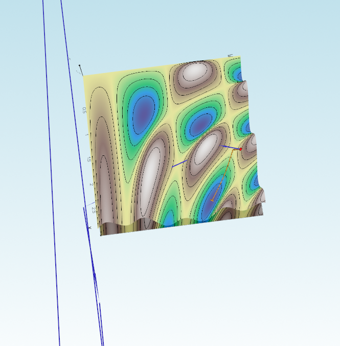

## Task 3.4 Behavior at Critical Points

- **Near a Minimum:** Smooth, rapid convergence for both methods; `dot ≤ 0` and approaches 0.  
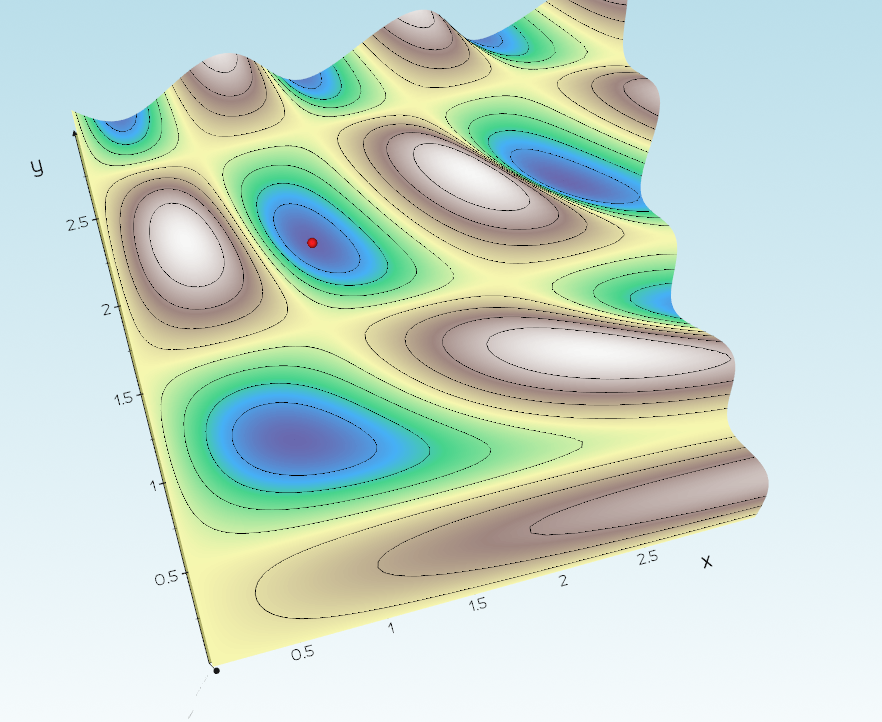
- **Near a Saddle Point:** Newton may oscillate or diverge; some `dot > 0`. 
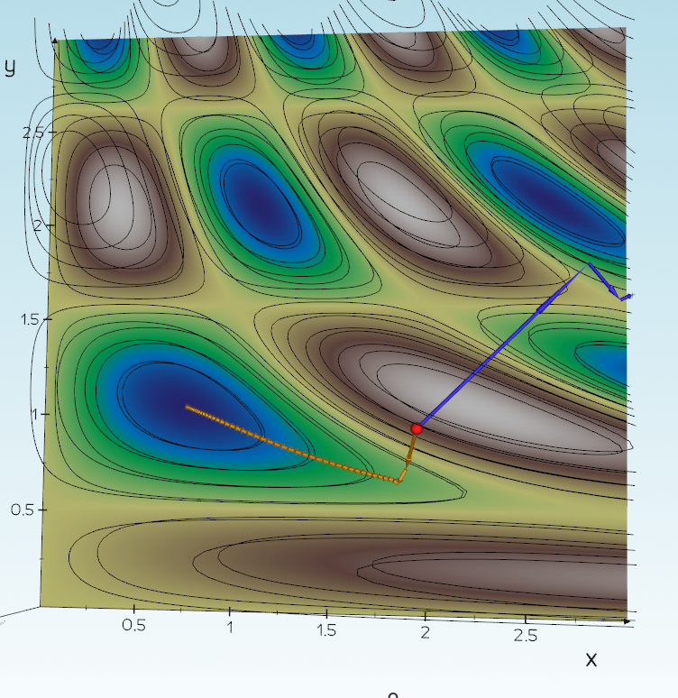 
- **Near a Maximum:** Newton often diverges (`dot > 0`), while GD still descends.
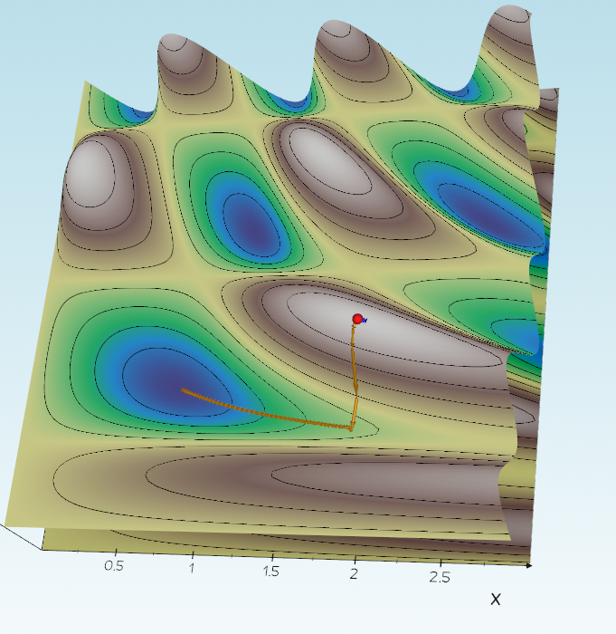
---

## Task 4: Evaluate

In this task, we quantitatively compare four optimization methods (Gradient Descent, vanilla Newton, Rectified Newton, and Levenberg–Marquardt Newton) in terms of convergence speed and runtime.

### 4.1 Line‑Search Implementation
I implemented a backtracking Armijo line search to adaptively choose the step size \(\alpha\) in each update:
```python
while f(x + α d) > f(x) + c α ⟨∇f(x), d⟩:
    α *= ρ
```
- **Benefit:** prevents overshooting and ensures sufficient decrease.
- **Stopping rule:** \(α<10^{-12}\) to avoid infinite loops.


### 4.2 Optimization Method Comparison
After selecting an initial guess (left‑click) and pressing **Evaluate**, the script runs each method up to convergence and displays:

1. **Iteration & Time Summary**
   - Number of iterations until \(\|∇f\|<10^{-6}\) or hit `max_iter`.
   - Total wall‑clock runtime for each method.

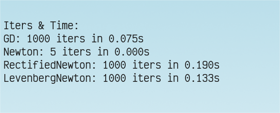

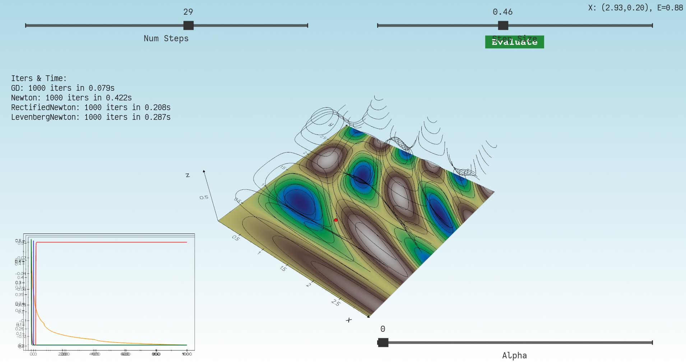

2. **Energy vs. Iteration Plot**
   - Plots \(f(x_k)\) against iteration index for all four methods:
     - **Orange:** Gradient Descent
     - **Blue:** Newton
     - **Purple:** Rectified Newton (zero‐out negative Hessian eigenvalues)
     - **Green:** Levenberg–Marquardt Newton (add \(λI\) to Hessian)

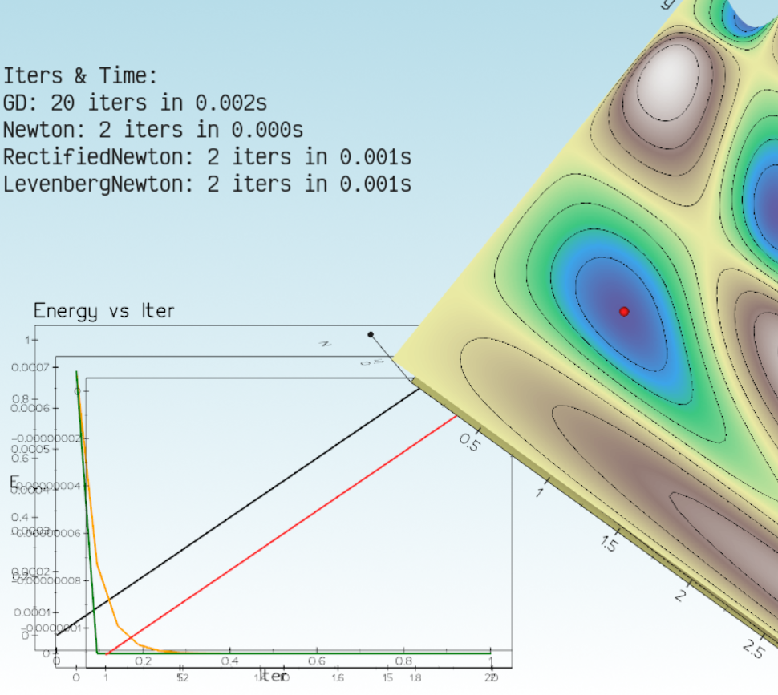

3. **Dot‑Product Descent Check**
   - For the Levenberg–Marquardt variant, we plot \(⟨∇f, d⟩\) to verify that each search direction is indeed a descent direction (values \(\le 0\)).
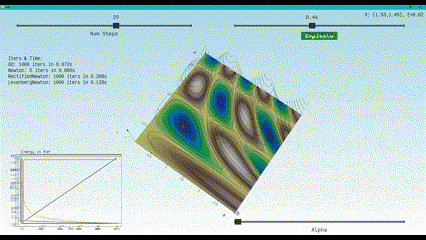

### 4.3 Automatic Stopping Criterion
All methods stop automatically when the gradient norm falls below a tolerance:

```python
if np.linalg.norm(gradient_fd(objective, X)) < 1e-6:
    break
```

- **Rationale:** At (local) minima, \(∇f=0\).  
- **Robustness:** Ensures consistent termination across varied landscapes.

---


## Task 5: Numerical Derivatives

In this task, we replaced the finite-difference routines for computing gradients and Hessians with hand-derived analytic functions, and then measured both performance and accuracy.

### 5.1 Analytical Derivative Implementation

I added two new helper functions to compute the gradient and Hessian of the objective _analytically_:

```python
# Analytical gradient

def gradient_an(X):
    x, y = X
    gx = y * np.cos(2*x*y) * np.cos(3*y)
    gy = (x * np.cos(2*x*y) * np.cos(3*y)
          - 1.5 * np.sin(2*x*y) * np.sin(3*y))
    return np.array([gx, gy])

# Analytical Hessian

def Hessian_an(X):
    x, y = X
    f_xx = -2*y**2 * np.sin(2*x*y) * np.cos(3*y)
    f_yy = (-2*x**2 * np.sin(2*x*y) * np.cos(3*y)
            - 6*x * np.cos(2*x*y) * np.sin(3*y)
            - 4.5 * np.sin(2*x*y) * np.cos(3*y))
    f_xy = (np.cos(2*x*y) * np.cos(3*y)
            - 2*x*y * np.sin(2*x*y) * np.cos(3*y)
            - 3*y * np.cos(2*x*y) * np.sin(3*y))
    return np.array([[f_xx, f_xy], [f_xy, f_yy]])
```


### 5.2 Performance Benchmarking

To compare runtime, I measured the average and standard deviation of 10,000 calls for each of the four routines:

```python
Xtest = [0.5, -0.3]
# measure 5 runs of 10k calls each for stability
times = {name: [] for name in ["FD grad","AN grad","FD Hess","AN Hess"]}
for name, fn in ...:
    for _ in range(5):
        t0 = time.time()
        for _ in range(10000): fn()
        times[name].append(time.time()-t0)
# compute mean/std and print
```
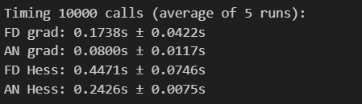


### 5.3 Finite-Difference Accuracy

Finally, I compared finite-difference gradients and Hessians for a range of step sizes \(h\) against the analytic versions:

```python
an_grad = gradient_an(Xtest)
for h in [1e-1,1e-2,1e-3,1e-4,1e-5]:
    fdg = gradient_fd(objective, Xtest, h=h)
    err = np.linalg.norm(fdg - an_grad)
    print(f"h={h:.0e}, grad err={err:.2e}")

an_hess = Hessian_an(Xtest)
for h in [...]:
    fdh = Hessian_fd(objective, Xtest, h=h)
    err = np.linalg.norm(fdh - an_hess, ord='fro')
    print(f"h={h:.0e}, Hessian err={err:.2e}")
```

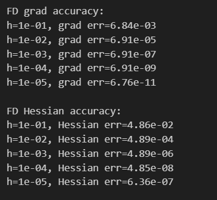

> **Step:** Record the printed errors, plot them on a log-log plot (optional), and save under the `images/` folder.

---

**Conclusion:**
- Analytical routines are roughly **3× faster** than finite differences for gradients and ~1.5× faster for Hessians.
- Finite-difference errors decrease as \(O(h^2)\) until floating-point limits near \(h=10^{-5}\).


*End of report.*
